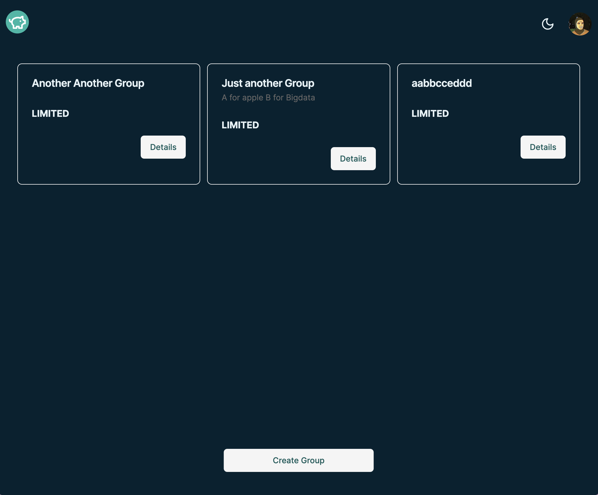
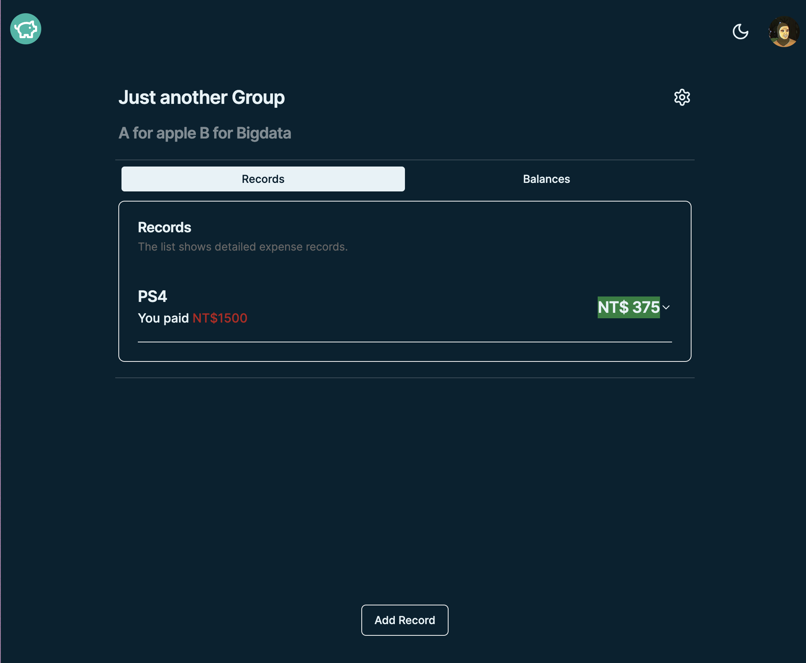
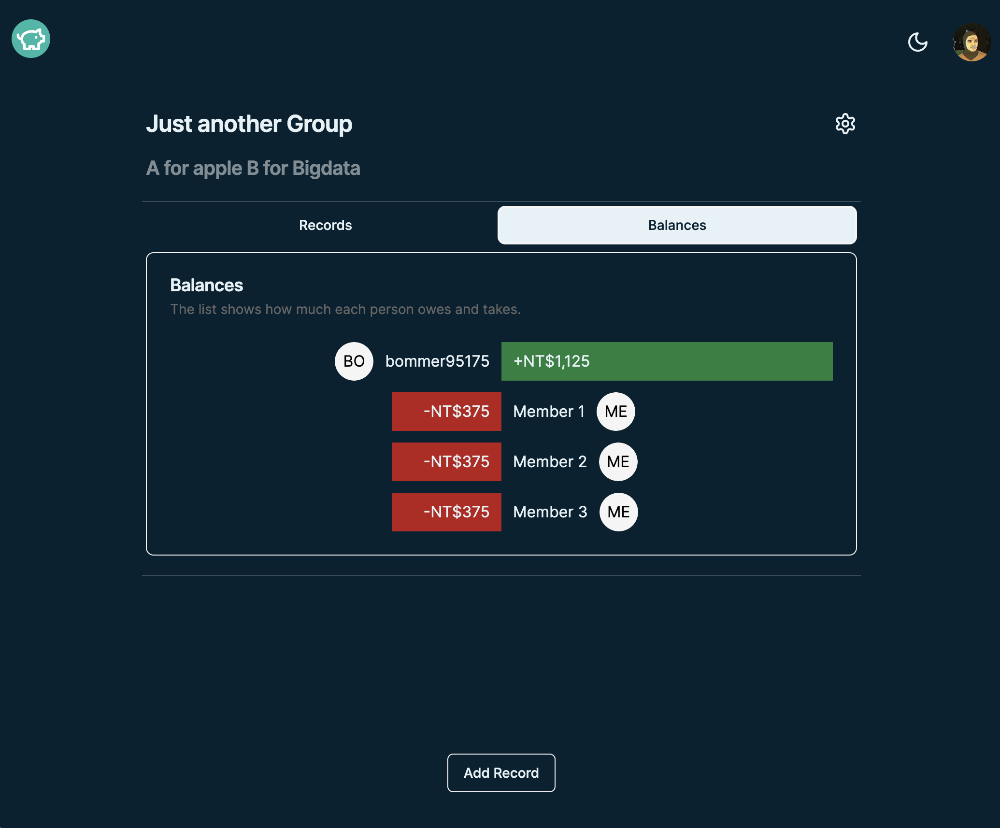

# LightSplit Clone Frontend

A full responsive LightSplit clone made with TailwindCSS and Nextjs.

## Live Demo

[Here](https://easysplit.erichandsen.dev/)

## Screenshots





## Tech Stack

- [Next.js](https://nextjs.org)
- [NextAuth.js](https://next-auth.js.org)
- [Tailwind CSS](https://tailwindcss.com)
- [tRPC](https://trpc.io)
- [shadcn/ui](https://ui.shadcn.com/)

## Features

- One-Click Balance Calculation
- Visualization of Expenses
- Ability to Add Payment Information
- Group Creation
- Adding Shared Expense
- Balance Review

## Getting Started

### Prerequisites

- node >=18.12.1
- pnpm >=8.6.3

### Installation

```bash
# Clone the repo
git clone https://github.com/ericsen-tsai/lightsplit-clone-frontend.git

# Navigate into the project directory
cd lightsplit-clone-frontend

# Install dependencies
pnpm install

# Start the development server
pnpm run dev
```

### Build

```bash
# Build the project
pnpm run build
```

### Deployment

This project is continuously deployed on [Vercel](https://vercel.com/).

## Contact

For more information or for any queries, feel free to reach out to me:

- [LinkedIn](https://www.linkedin.com/in/ericsen-tsai-a00948236/)
- [GitHub](https://github.com/ericsen-tsai)
- [GitLab](https://gitlab.com/ericsentsai)
- Email: <bommer95175@gmail.com>
